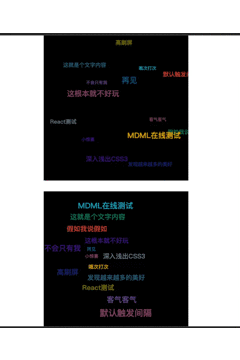

##  词云图


File           |  % Stmts | % Branch |  % Funcs |  % Lines | Uncovered Line #s |
---------------|----------|----------|----------|----------|-------------------|
All files      |    62.69 |       60 |    52.63 |    61.02 |                   |
 src           |    40.48 |       40 |       25 |    41.03 |                   |
  WordChart.ts |    40.48 |       40 |       25 |    41.03 |... 63,66,67,69,71 |
 src/helper    |      100 |      100 |      100 |      100 |                   |
  constant.ts  |      100 |      100 |      100 |      100 |                   |
  utils.ts     |      100 |      100 |      100 |      100 |                   |
### 简介
#### 优点:
 `相比目前大众开源的词图， 增加了更多的配置， 且支持自定义渲染和tooltop， 不会遗漏数据，哪怕数据的占比很小或者相同占比却没有空间渲染的情况，目前其他词图库会默认选择遗漏，支持滚动假3d模式， 可配置斜率`
#### 缺点：
 `目前暂不支持在词内渲染，未基于目前流行库canvas碰撞检测的做法，相比带来的好处就是更高的性能，更小的内存消耗，当单词超出时或者区域渲染内容空闲空间太多时会自动缩放到全屏状态，所以会和配置的fontSizeRange有一定的误差，但带来了更好的视觉效果`
### 纯js开发，无任何第三方依赖
### 基于函数式编程，可在原库上追加自己的业务
### 扩展性强，可自定义追加动画和其他数据
### TS构建，丰富的测试用例
### API
### 数据格式
默认配置：
```ts
const config = {
  el: document.querySelector('#app'),
  data: [
    {
      name: 'node1',
      value: 'node1',

    }
    ...
  ],
  config: {
    fontSizeRange: [12, 24],
    renderFn?:() => HTMLELEMENT | HTMLString,
    speed: 50,
    autoSuit: true, // 自动适配试图
    
    ...
  },
  lifeCycle: {
    beforeSacn: ({item, index, instance}) => ({item, index, instance}),
    afterScan: ({item, index, instance}) => ({item, index, instance}),
    effect: ({item, index, instance}) => void
  }
}
```
## todos
* 完善文档
* 增加测试用例
* 增加配置和api
* 基于该库开发vue， react对应的组件
